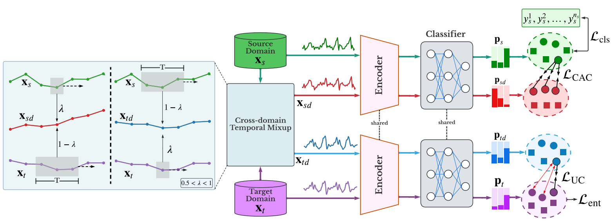

# CoTMix:  Contrastive Domain Adaptation for Time-Series via Temporal Mixup [[Paper](https://arxiv.org/abs/2212.01555)] [[Cite](#citation)]

This work has been accepted for publication in [IEEE Transactions on Artificial Intelligence (TAI).](https://ieeexplore.ieee.org/document/10177231)

### The code and the experimental datasets are adopted from [AdaTime framework](https://github.com/emadeldeen24/AdaTime)

## Abstract
<p align="center">

</p>

Unsupervised Domain Adaptation (UDA) has emerged as a powerful solution for the domain shift problem via transferring the knowledge from a labeled source domain to a shifted unlabeled target domain. Despite the prevalence of UDA for visual applications, it remains relatively less explored for time-series applications. In this work, we propose a novel lightweight contrastive domain adaptation framework called *CoTMix* for time-series data. Unlike existing approaches that either use statistical distances or adversarial techniques, we leverage contrastive learning solely to mitigate the distribution shift across the different domains. Specifically, we propose a novel temporal mixup strategy to generate two intermediate augmented views for the source and target domains. Subsequently, we leverage contrastive learning to maximize the similarity between each domain and its corresponding augmented view. The generated views consider the temporal dynamics of time-series data during the adaptation process while inheriting the semantics among the two domains. Hence, we gradually push both domains towards a common intermediate space, mitigating the distribution shift across them. Extensive experiments conducted on five real-world time-series datasets show that our approach can significantly outperform all state-of-the-art UDA methods. 


## Citation
If you found this work useful for you, please consider citing it.
```
@ARTICLE{emadeldeen2023cotmix,
  author={Eldele, Emadeldeen and Ragab, Mohamed and Chen, Zhenghua and Wu, Min and Kwoh, Chee-Keong and Li, Xiaoli},
  journal={IEEE Transactions on Artificial Intelligence}, 
  title={Contrastive Domain Adaptation for Time-Series Via Temporal Mixup}, 
  year={2023},
  volume={},
  number={},
  pages={1-10},
  doi={10.1109/TAI.2023.3293473}
}
```

## Contact
For any issues/questions regarding the paper or reproducing the results, please contact me.   
Emadeldeen Eldele   
School of Computer Science and Engineering (SCSE),   
Nanyang Technological University (NTU), Singapore.   
Email: emad0002{at}e.ntu.edu.sg 
